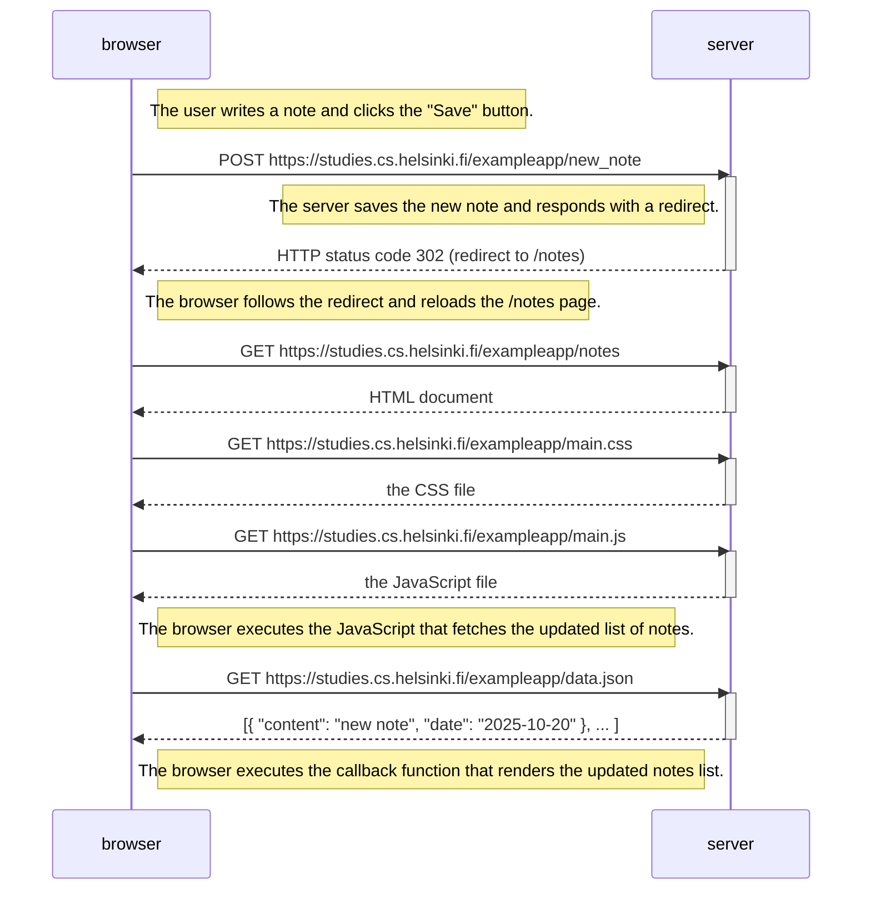

```mermaid
sequenceDiagram
participant browser
participant server

    Note right of browser: The user writes a note and clicks the "Save" button.

    browser->>server: POST https://studies.cs.helsinki.fi/exampleapp/new_note
    activate server
    Note left of server: The server saves the new note and responds with a redirect.
    server-->>browser: HTTP status code 302 (redirect to /notes)
    deactivate server

    Note right of browser: The browser follows the redirect and reloads the /notes page.

    browser->>server: GET https://studies.cs.helsinki.fi/exampleapp/notes
    activate server
    server-->>browser: HTML document
    deactivate server

    browser->>server: GET https://studies.cs.helsinki.fi/exampleapp/main.css
    activate server
    server-->>browser: the CSS file
    deactivate server

    browser->>server: GET https://studies.cs.helsinki.fi/exampleapp/main.js
    activate server
    server-->>browser: the JavaScript file
    deactivate server

    Note right of browser: The browser executes the JavaScript that fetches the updated list of notes.

    browser->>server: GET https://studies.cs.helsinki.fi/exampleapp/data.json
    activate server
    server-->>browser: [{ "content": "new note", "date": "2025-10-20" }, ... ]
    deactivate server

    Note right of browser: The browser executes the callback function that renders the updated notes list.
```
