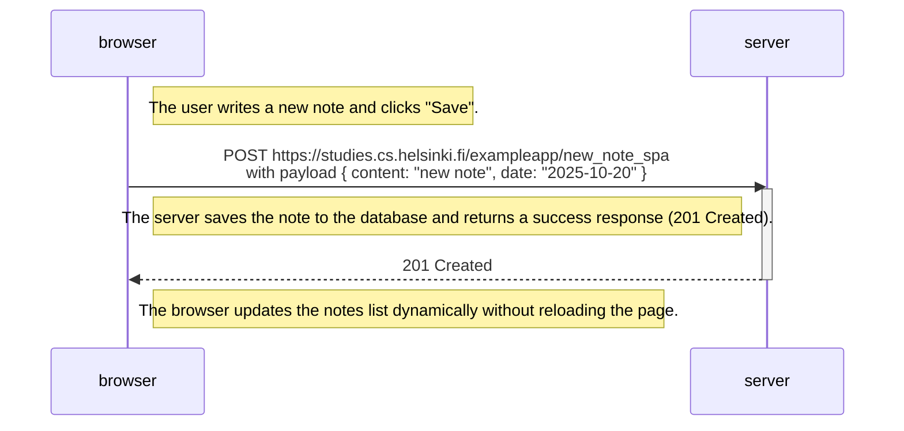

```mermaid
sequenceDiagram
    participant browser
    participant server

    Note right of browser: The user writes a new note and clicks "Save".

    browser->>server: POST https://studies.cs.helsinki.fi/exampleapp/new_note_spa<br>with payload { content: "new note", date: "2025-10-20" }
    activate server
    Note left of server: The server saves the note to the database and returns a success response (201 Created).
    server-->>browser: 201 Created
    deactivate server

    Note right of browser: The browser updates the notes list dynamically without reloading the page.

```
